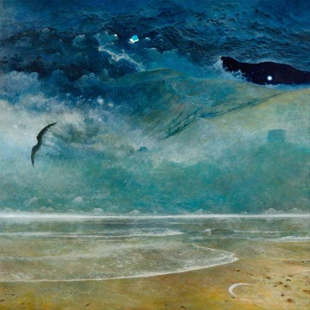

# LoRA Training Project

## Project Description
This repository contains the code and configuration to train a **LoRA (Low-Rank Adaptation) model** for image generation.  
LoRA enables efficient fine-tuning of large pre-trained models by updating only a small set of low-rank weights, reducing computational and memory requirements.  

This project specifically focuses on generating images inspired by the **Zdzisław Beksiński** art style.

---

## 1. Installation

### Requirements
- **Python**: 3.10  
- **PyTorch**: 2.2.0  
- **CUDA**: 12.1.1 (devel) on Ubuntu 22.04  

**Recommended System Configuration:**  
| Component | Specification | Notes |
|-----------|---------------|-------|
| RAM       | 151 GB        | Eliminates risk of Out-of-Memory (OOM) errors |
| vCPU      | 9             | Sufficient for smooth data processing |
| Disk      | 400 GB        | Enough space for OS, container, base model, dataset, and checkpoints |
| GPU       | NVIDIA L40 48 GB VRAM | Ideal for training large LoRA models like Flux or Qwen |

---
## 2. Workspace Setup on RunPod

1. **Install ComfyUI**  
   ```bash
   git clone https://github.com/comfyanonymous/ComfyUI.git
   ```
2. **Create a Python virtual environment**
    ```bash
    python -m venv venv
    ```
3. **Activate the environment**
    ```bash
    source venv/bin/activate
    ```
4. **Install ComfyUI Manager**
    ```bash
    git clone https://github.com/Comfy-Org/ComfyUI-Manager
    ```
5. **Launch ComfyUI**
  - Close your terminal and open a new one

  - Activate the environment again:
    ```bash
    source venv/bin/activate
    ```
  - Navigate to ComfyUI folder:
    ```bash
    cd ComfyUI
    ```
  - Launch the web interface:
    ```bash
    python main.py --listen
    ```
  - Wait ~30 seconds until a local address with port 8188 appears, indicating ComfyUI is running
6. **Access ComfyUI from browser**
  - In RunPod, locate Direct TCP Port Mapping
  - Copy the Public IP and external port (e.g., "http://206.41.93.58:52271/")
  - Paste into your browser to open ComfyUI with ComfyUI Manager
7. **Load JSON models to generate new images using the Qwen model**

## 3. Notes
- Ensure the Python virtual environment is activated before running any scripts
- Large datasets and models require sufficient disk space and memory to prevent crashes
- Recommended hardware: NVIDIA L40 GPU, 151 GB RAM, 400 GB disk
## 4. References
- Image Models
   - SD1.x,[unCLIP](https://comfyanonymous.github.io/ComfyUI_examples/unclip/))
- [ComfyUI GitHub](https://github.com/comfyanonymous/ComfyUI)
- [ComfyUI Manager GitHub](https://github.com/Comfy-Org/ComfyUI-Manager)

    
# 🧠 LoRA Training Summary

This section summarizes the configuration and workflow used to train a **LoRA (Low-Rank Adaptation)** model using **ComfyUI v0.4**.

---

## 📂 Dataset Configuration

| Parameter | Value |
|------------|--------|
| **Source Folder** | `dataset_Lora_test` |
| **Node Used** | `LoadImageTextSetFromFolderNode` |
| **Resize Method** | None *(original resolution preserved)* |
| **Width / Height** | `-1 / -1` |
| **CLIP Conditioning** | Enabled |

**Process Overview:**  
Images and captions are loaded from the `dataset_Lora_test` folder.  
The dataset keeps its original resolution, and CLIP text conditioning is applied for effective text-to-image alignment.

---

## 🧩 Base Model

| Component | Value |
|------------|--------|
| **Checkpoint** | `sd_xl_base_1.0.safetensors` |
| **Node Used** | `CheckpointLoaderSimple` |
| **Outputs** | MODEL, CLIP, VAE |

**Description:**  
The **Stable Diffusion XL base model** provides:  
- **MODEL**: Core diffusion model weights  
- **CLIP**: Text encoder for conditioning  
- **VAE**: Encoder/decoder for latent space transformation  

---

## 🌀 Latent Encoding

| Parameter | Value |
|------------|--------|
| **Node Used** | `VAEEncode` |
| **Input** | Dataset images |
| **Output** | Latent representations for LoRA training |

**Process:**  
Each image from the dataset is encoded into latent space using the base model’s VAE.  
These latents are used as inputs during LoRA training.

---

## ⚙️ LoRA Training Configuration

| Setting | Value |
|----------|--------|
| **Node Used** | `TrainLoraNode` |
| **Batch Size** | `1` |
| **Grad Accumulation Steps** | `8` |
| **Training Steps** | `1000` |
| **Learning Rate** | `0.0003` |
| **Optimizer** | `AdamW` |
| **Loss Function** | `MSE` *(Mean Squared Error)* |
| **Seed** | `550337636151787` |
| **Rank** | `8` |
| **Training Data Type** | `bf16` |
| **LoRA Data Type** | `bf16` |
| **Algorithm** | `LoRA` |
| **Gradient Checkpointing** | ✅ Enabled |
| **Existing LoRA** | `None` |

**Notes:**  
- `bf16` precision reduces VRAM usage while maintaining stability.  
- **AdamW** optimizer is ideal for fine-tuning low-rank parameters.  
- Gradient checkpointing minimizes memory usage during backpropagation.

---

## 💾 Outputs

| Output | Description / Path |
|---------|--------------------|
| **LoRA Model** | `loras/ChangedDataset` |
| **Loss Graph** | `loss_graph` |
| **Preview Image** | Displayed via `PreviewImage` node |

---

## 🧭 Workflow Summary

1. **Load Dataset** → Import images and captions from `dataset_Lora_test`.  
2. **Load Base Model** → Initialize `sd_xl_base_1.0.safetensors` (MODEL, CLIP, VAE).  
3. **Encode Latents** → Convert dataset images into latent representations using the VAE.  
4. **Train LoRA** → Fine-tune LoRA adapter layers with defined hyperparameters.  
5. **Save Outputs** → Export trained LoRA weights, loss graph, and preview image.

---

## 🧾 Key Takeaways

- **ComfyUI v0.4** workflow provides a modular visual setup for LoRA training.  
- **bf16 precision** improves memory efficiency without quality loss.  
- **Rank 8 LoRA** offers a good trade-off between flexibility and model size.  
- The resulting LoRA (`loras/ChangedDataset`) can be merged or applied to compatible **SDXL** models for personalization or style transfer.

---

> 🧩 **Tip:** This data setup can be extend to obtain better results by chaining multiple training datasets, enabling CLIP skip, or integrating custom loss functions for domain-specific LoRAs.

# 📝 Small Dataset Considerations for LoRA Training

This LoRA training setup was carefully designed for a **small dataset** of **149 images**. Full model fine-tuning would overfit with such limited data, but LoRA is ideal here because it updates only a **low-rank subset of weights**, allowing the model to learn a new style without catastrophic forgetting.

---

## 🔧 Key Parameter Choices

| Parameter | Value | Reasoning |
|-----------|-------|-----------|
| **Gradient Accumulation** | 8 | Effectively increases batch size without needing more GPU memory. |
| **Low Rank** | 8 | Limits the number of trainable parameters to prevent overfitting. |
| **Learning Rate** | 0.0003 | Moderate rate avoids large weight updates that could overfit. |
| **Training Steps** | 1000 | With 149 images, each image is seen multiple times, giving effective epochs: `(1000 × 8) / 149 ≈ 53`. This is reasonable for small datasets. Each image is effectively seen ~53 times during training due to gradient accumulation.|
| **Loss Function** | MSE | Provides a stable learning signal. Unlike perceptual or adversarial losses, MSE is lightweight, predictable and ideal for small datasets; helps the LoRA learn subtle style differences without unstable gradients from adversarial losses. |
| **Precision** | bf16 | Reduces memory usage while maintaining sufficient precision for large models. |
| **Gradient Checkpointing** | Enabled | Allows training without a massive GPU by saving memory. |

---

## 🧠 Rationale

- Previous attempts with small datasets **overfitted the model**, so parameters were carefully tuned this time.  
- Using **LoRA with low-rank updates** allows learning new styles without modifying the full model.  
- **Gradient accumulation** combined with **batch size 1** simulates an effective batch of 8, making training more stable.  
- **1000 training steps** ensure each image is seen multiple times, giving **≈53 effective epochs**, which is reasonable for 149 images.  
- **MSE loss** allows the model to learn subtle stylistic details effectively, offering a stable and efficient learning signal. This avoids the unpredictable gradients and potential overfitting that can arise when using perceptual or adversarial losses, especially on small datasets.  
- Memory optimization with **bf16 precision + gradient checkpointing** allows training large models on limited hardware.  

---

## ✅ Summary

This setup is **well-tuned for a small dataset**:

- Low-rank LoRA avoids overfitting.  
- Gradient accumulation + bf16 keeps memory usage low.  
- Moderate learning rate + 1000 steps ensures convergence.  
- With 149 images, the model can learn the author’s style reasonably well without requiring a huge dataset.  

> Overall, this training configuration balances **learning efficiency**, **memory constraints**, and **overfitting prevention** for small datasets.


# 🎨 Dataset Overview

My image dataset consisted of **149 mixed paintings**, each paired with a **positive prompt**.  
Approximately **30 out of 149 images** included light scene descriptions — still focused primarily on **artistic style** rather than narrative content.

To enhance stylistic diversity and strengthen **LoRA learning**, each image was associated with **2–3 prompt variations**, phrased differently but describing the same overall aesthetic.

---

## 🧩 Examples

### Example 1 — Abstract (“pure style”)
   ```bash
<mojstylbeksinskiego> <mojstylbeksinskiego>, (masterpiece, best quality, ultra detailed), dystopian surrealism, painterly brush strokes, oil painting on hardboard, muted tones, dramatic lighting, surreal organic shapes, elongated forms, expression of despair and transcendence, atmospheric perspective
   ```
### Example 2 — Scene-based (“landscape / composition”)
   ```bash
A humanoid figure with bandaged head walking through ruins, painted in <mojstylbeksinskiego> style, elongated anatomy, haunting atmosphere, soft oil textures, dark red sky, emotional tension, chiaroscuro shadows
   ```
### 💀 Example 3 — Emotional variation
   ```bash
<mojstylbeksinskiego> <mojstylbeksinskiego>, somber surrealism, expressive brush strokes, depiction of anguish, blurred figures, oil painting technique, heavy textures, cold desaturated tones
   ```
---

## 🗂️ File Structure Example
image_001_1.jpg → 001_1.txt
image_001_2.jpg → 001_2.txt
image_001_3.jpg → 001_3.txt

---

## 💡 Why It Works

- 🔹 **Token reinforcement** — Repeating `<mojstylbeksinskiego>` at the beginning helps anchor the unique token.  
- 🔹 **Light textual variation** — Small changes in phrasing teach the model to understand the range of the style rather than memorize fixed descriptions.  
- 🔹 **Tag permutation** — Mixing the order of tags (lighting, color, composition) provides CLIP with richer contextual signals.  
- 🔹 **Phrase order shuffling** — Moving color information toward the beginning or end helps CLIP better capture *conceptual* rather than *syntactic* connections.

Using the same token (`<mojstylbeksinskiego>`) across all paintings ensures that **LoRA recognizes it as a shared stylistic identity.**

---

## 🌌 “Quiet” Compositions

To maintain balance and prevent overfitting on dense, figure-heavy scenes, the dataset also included **1–2 calm compositions** — such as minimal landscapes or architectural fragments.

Each of these “quiet” images had **three gentle prompt variants**, focusing on **atmosphere and color harmony** rather than complex structures.

---

### Example (Quiet Scene – `041`)

#### `041_1.jpg`
   ```bash
<mojstylbeksinskiego>, masterpiece, best quality, ultra-detailed, 8k, sharp focus, dark cosmic seascape, surreal misty shore with sandy reflective beach, turbulent dark night sky blending into crashing waves, massive mountainous wave or fog-shrouded hills in background, deep cool blue and teal palette, scattered bright stars and celestial glow mixed into clouds and waves, dark abstract entity with a bright star inside (upper right), solitary dark bird in flight (left center), small crescent shape on sand, highly textured oil painting on canvas, haunting, mysterious, nocturnal:1.4
   ```
#### `041_2.jpg`
   ```bash
<mojstylbeksinskiego>, ultra-detailed masterpiece, best quality, 8k, sharp focus, dark cosmic seascape, misty surreal shoreline with wet reflective sand, crashing waves merging with turbulent night sky, massive mountainous wave or fog-covered hills in distance, celestial glow and scattered stars woven into clouds and waves, dark abstract entity containing bright star in upper right, solitary bird or seagull flying left of center, small crescent shape on sand, deep cool blue and teal palette, highly textured oil painting on canvas, haunting, nocturnal, mysterious:1.4
   ```
#### `041_3.jpg`
   ```bash
<mojstylbeksinskiego>, best quality, masterpiece, ultra-detailed 8k, sharp focus, dark cosmic seascape, surreal misty shore, sandy beach with reflective wet edge, turbulent dark sky blending with crashing waves, massive mountainous wave or fog-shrouded hills in background, scattered stars and celestial glow in clouds and waves, dark abstract entity with bright star (upper right), solitary dark bird in flight (left center), small crescent on sand, deep cool blue and teal palette, highly textured oil painting on canvas, haunting, mysterious, nocturnal:1.4
   ```
---

### 🧠 Dataset Balance Strategy

“Quiet” scenes were **interleaved between every 8–10 dense compositions**, ensuring that **LoRA learned to transfer stylistic features** without overtraining on complex multi-figure scenes.

---

_Example of a “quiet” composition from the dataset (image 041)._

# 🖼️ Image generation

This section outlines the workflow for generating a series of "paintings" / "pseudo-photos" of your Krakow town in the style of an artist using **LoRA and text conditioning**.

---

## 📂 1. Step 1: Load Images

| Node | Type | Parameters |
|------|------|------------|
| **EmptyLatentImage** | `EmptyLatentImage` | Width: `768`, Height: `768`, Batch Size: `1` |

**Description:**  
Creates empty latent tensors as a starting point for image generation.

---

## 📂 2. Step 2: Load Base Models

| Node | Type | Parameters / Checkpoints |
|------|------|-------------------------|
| **UNETLoader** | `UNETLoader` | Checkpoint: `qwen_image_fp8_e4m3fn.safetensors`, Weight dtype: `default` |
| **VAELoader** | `VAELoader` | VAE: `qwen_image_vae.safetensors` |
| **CLIPLoader** | `CLIPLoader` | CLIP: `qwen_2.5_vl_7b_fp8_scaled.safetensors`, Type: `qwen_image`, Device: `default` |

**Description:**  
Loads the core components for image generation:  
- **UNet**: Diffusion backbone  
- **VAE**: Latent encoding/decoding  
- **CLIP**: Text embedding encoder  

---

## 📂 3. Step 3: Prompt Conditioning

| Node | Type | Parameters |
|------|------|------------|
| **CLIPTextEncode (Positive Prompt)** | `CLIPTextEncode` | `<lora:mojstylbeksinskiego:1.0>, <mojstylbeksinskiego>, masterpiece:1.5, ultra detailed:1.5, soft dystopian surrealism:1.4, (Wawel Castle:1.5), gothic castle towers:1.4, empty castle courtyard:1.4, pale evening light:1.4, ...` |
| **CLIPTextEncode (Negative Prompt)** | `CLIPTextEncode` | `low quality, blurry, out of focus, pixelated, cartoonish, modern elements, neon signs, bright saturated colors, smiling people, daytime, sunny sky, futuristic city, modern cars, cluttered streets, text, watermark, signature, overexposed, unrealistic colors, poorly detailed` |

**Description:**  
Encodes text prompts into **CLIP embeddings** for conditioning the diffusion model.  
- **Positive prompt**: Style, subject, and artistic directions  
- **Negative prompt**: Artifacts and undesired elements  

---

## 📂 4. Step 4: Apply LoRA Style

| Node | Type | Parameters |
|------|------|------------|
| **LoraLoaderModelOnly** | `LoraLoaderModelOnly` | LoRA: `ImrovedDatabase_1000_steps_00001_.safetensors`, Strength: `1` |

**Description:**  
Applies a **pre-trained LoRA** to the UNet for style or subject adaptation.

---

## 📂 5. Step 5: Sampling & Latent Processing

| Node | Type | Parameters |
|------|------|------------|
| **KSampler** | `KSampler` | Sampler: `euler`, Steps: `50`, CFG: `7.5`, Seed: `0`, Denoise: `1`, Scheduler: `simple` |
| **ModelSamplingAuraFlow** | `ModelSamplingAuraFlow` | Shift: `3.12` |

**Description:**  
- **KSampler**: Performs diffusion sampling to generate latent images  
- **ModelSamplingAuraFlow**: Adds subtle style/shift modifications to the latent output  

---

## 📂 6. Step 6: Decode & Preview Images

| Node | Type | Parameters |
|------|------|------------|
| **VAEDecode** | `VAEDecode` | Converts latent images back to RGB images using loaded VAE |
| **PreviewImage** | `PreviewImage` | Displays generated images for quick inspection |

**Description:**  
Decodes the final latent representations into images and previews them.

---

## 📂 7. Step 7: Save Output

| Node | Type | Parameters |
|------|------|------------|
| **SaveImage** | `SaveImage` | Filename prefix: `Bsilicatokeniqwen lessdetails` |

**Description:**  
Saves generated images to disk with a specific naming convention.

---

## 🧭 Workflow Summary

1. **Create Latents** → Start with empty latent images.  
2. **Load Models** → UNet, VAE, and CLIP are loaded for generation.  
3. **Encode Prompts** → Positive and negative text conditioning is applied.  
4. **Apply LoRA** → Style or subject adaptation is applied to the UNet.  
5. **Sampling** → Latents are processed with KSampler and optional aura shifts.  
6. **Decode & Preview** → Latents are decoded and displayed as images.  
7. **Save Output** → Final images are saved to disk.

---

## 🧾 Notes

- **LoRA integration** allows flexible style transfer without retraining the base model.  
- **Positive & Negative prompts** control aesthetics and artifact suppression.  
- **Preview nodes** provide instant visual feedback during workflow execution.  
- **Shift and sampler parameters** allow fine-tuning of diffusion output.

# Beksinski-Inspired LoRA Guide for Kraków

This section explains the training of the LoRA on dystopian surrealism and provides guidance on generating Kraków cityscapes that remain faithful to the learned aesthetic.

---

## 1. What LoRA Learned

Training prompt example:

> "fantastic realism, dystopian surrealism, apocalyptic landscapes, humanoid forms, dark gritty oil painting texture, deep shadows, inferno tones"

LoRA likely encoded:

- **Colors:** reds, oranges, browns, deep shadows  
- **Texture:** painterly, rough, oil-on-hardboard  
- **Composition:** surreal, twisted, emotionally heavy  
- **Lighting:** high contrast, dramatic glow  

> The LoRA biases outputs toward this visual style.

---

## 2. Positive Prompt Structure

```text
<mojstylbeksinskiego>, masterpiece, ultra-detailed, oil painting, dystopian surrealism, apocalyptic atmosphere, burning skies, ruins, decayed architecture, deep shadows, cinematic lighting, (city of Kraków:1.3), gothic buildings, empty streets, mood of despair

```
Notes:
- &lt;mojstylbeksinskiego&gt; → activates LoRA style
- Scene keywords → e.g., Kraków landmarks
- Style modifiers → e.g., "smoke and mist, dark red glow"
- Weight modifiers → e.g., (Kraków old town:1.2)
## 3. Example Variations
Full Dystopian Kraków:
```text
<mojstylbeksinskiego>, masterpiece, ultra-detailed, apocalyptic dystopian surrealism, ruins of Kraków, burning sky, decaying gothic architecture, empty streets, haunting atmosphere, red inferno light
```
Subtle Surreal Kraków:
```text
<mojstylbeksinskiego>, masterpiece, ultra-detailed, atmospheric realism, Kraków cityscape at dusk, surreal mood, dark textures, oil painting brushwork, soft inferno glow
```
## 4. Negative Prompt
```text
(worst quality, low quality, blurry, oversaturated, cartoonish, unrealistic proportions, bad anatomy, extra limbs, text, watermark, modern cars, neon lights, bright colors)
(bad hands, extra legs, deformed faces, JPEG artifacts, lowres, out of frame, cropped, distorted)
```
Ensures outputs remain consistent with the dystopian, painterly aesthetic.
## 5. Prompt Tips
```text
<lora:mojstylbeksinskiego:1.0>, <mojstylbeksinskiego>, masterpiece, ultra-detailed, oil painting, dystopian surrealism, Kraków ruins under red sky
```
- :1.0 → LoRA strength (can be adjusted in a range 0.8–1.2)
- Use 1–2 style tokens; avoid repetition
## 6. Optional Scene Enhancements
Scene	Prompt Addition
| Scene         | Prompt Addition                                                      |
| ------------- | -------------------------------------------------------------------- |
| Wawel Castle  | `(Wawel Castle:1.3), decaying fortress, smoke and mist, burning sky` |
| Market Square | `(Rynek Główny:1.3), ruined town square, scattered debris`           |
| Vistula River | `(Vistula River:1.3), dark waters reflecting red inferno glow`       |
## 7. Summary
- In the prompts, the LoRA tag was used once or twice.  
- Combined with location-specific descriptors.  
- Applied together with a strong negative prompt.  
- LoRA weight adjusted in the range of 0.8–1.2.  
- Scene modifiers were used for emphasis.  
- Extreme keywords were reduced for subtler outputs.  

## 8. Interpreting Generated Results

After running the LoRA prompts, outputs may vary depending on LoRA strength, scene modifiers, and prompt specificity. Here's what to look for:

### 8.1 Visual Style
- **Color Palette:** Look for dominant reds, oranges, browns, and deep shadows.  
- **Texture:** Painterly, rough, oil-on-hardboard appearance.  
- **Lighting:** High contrast, dramatic glow, or inferno-like highlights.  
- **Composition:** Surreal, twisted, emotionally heavy cityscapes.

### 8.2 Kraków Landmarks
- Wawel Castle, Rynek Główny, or Vistula River may appear warped, decayed, or dystopian.  
- Modifiers like `(Wawel Castle:1.3)` help emphasize landmark recognition while keeping the LoRA’s style.

### 8.3 Common Artifacts
- Slightly distorted architecture or extra limbs if human figures are included.  
- Over-saturated skies or exaggerated shadows at higher LoRA strength (>1.0).  
- Cropped or out-of-frame elements if the scene is complex or prompt lacks clear framing.

### 8.4 Adjusting Results
- **LoRA Strength:** Reduce from 1.0 → 0.8 for subtler style. Increase → 1.2 for more dramatic effects.  
- **Negative Prompts:** Remove unwanted elements (e.g., modern cars, neon lights, bright colors).  
- **Scene Modifiers:** Add or adjust weights for landmarks or specific atmospheres.  
- **Prompt Simplification:** Remove overly complex keywords to reduce visual clutter.

> By comparing multiple generations with slight prompt or weight adjustments, outputs can be refined toward a consistent Beksinski-inspired Kraków cityscape.

# Kraków Surrealist LoRA Prompts — Beksiński Style

This repository contains a curated set of **ready-to-use prompts** for generating surreal, dark, and painterly depictions of Kraków using a Beksiński-inspired LoRA trained on 149 images. Each prompt is optimized for **SDXL LoRA** generation and emphasizes dystopian, apocalyptic, and painterly aesthetics while retaining recognizable city landmarks.

---

## Usage Instructions

- **LoRA Weight:** 0.8–1.2 (adjust for stronger/weaker stylistic influence)  
- **Sampler:** DPM++ 2M Karras or Euler A  
- **CFG Scale:** 7–9 (higher → more stylized, lower → more natural)  
- **Steps:** 25–35 (sufficient for detailed output)  
- **Seed:** Optional — fix for consistent composition across renders  

---

## Prompts

### 1. Wawel Castle — “Apocalyptic Fortress”

**Positive Prompt:**
```text
<lora:mojstylbeksinskiego:1.0>, <mojstylbeksinskiego>, masterpiece, best quality, ultra detailed, dystopian surrealism, (Wawel Castle:1.3), gothic fortress on a hill, burning sky, red inferno light, heavy smoke, ruined battlements, decaying stone, crawling humanoid figures in distance, deep shadows, oil painting on hardboard
```
Negative Prompt:
```text
(worst quality, low quality, blurry, cartoonish, oversaturated, bright cheerful colors, text, watermark, modern cars, people, bad anatomy, extra limbs, deformed)
```
### 2. Main Market Square — “Ruins of Rynek Główny”
Positive Prompt:
```text
<lora:mojstylbeksinskiego:1.0>, <mojstylbeksinskiego>, masterpiece, ultra detailed, apocalyptic surrealism, (Rynek Główny Kraków:1.3), destroyed town square, broken monuments, collapsed St. Mary’s Basilica, red-orange inferno glow, smoke and dust, desolate streets, oil painting brushwork, dark atmospheric lighting
```
### 3. Vistula River — “Drowned Kraków”
Positive Prompt:
```text
<lora:mojstylbeksinskiego:1.0>, <mojstylbeksinskiego>, masterpiece, ultra detailed, surreal dystopian landscape, (Vistula River:1.3), flooded ruins of Kraków, submerged bridges, red reflections on dark water, smoke rising from distance, ruined skyline, decayed buildings, muted colors, atmospheric perspective, oil painting texture
```
Negative Prompt:
```text
(bad quality, cartoonish, bright sunlight, clean modern city, text, watermark, oversaturated, low detail, cropped, distorted)
```
### 4. Kazimierz District — “Haunted Streets”
Positive Prompt:
```text
<lora:mojstylbeksinskiego:1.0>, <mojstylbeksinskiego>, masterpiece, best quality, ultra detailed, dystopian surrealism, (Kazimierz Kraków:1.3), narrow cobblestone streets, ruined synagogues, cracked walls, burning sky above, twisted metal, crawling shadows, oil painting on rough canvas, eerie silence
```
Negative Prompt:
```text
(bad hands, extra limbs, cartoon, anime, neon, happy mood, bright colors, low quality, text, watermark)
```
## 5. Kazimierz District — “Haunted Streets”
Positive Prompt:
```text
<lora:mojstylbeksinskiego:1.0>, <mojstylbeksinskiego>, masterpiece, ultra detailed, surreal oil painting, panoramic view of Kraków, apocalyptic skyline, burning clouds, dark horizon, broken towers, decayed buildings, haunting atmosphere, cinematic lighting, deep red tones, fantastic realism
```
Negative Prompt:
```text
(lowres, blurry, bright pastel colors, cartoonish, oversaturated, text, watermark, distorted, photographic noise, bad anatomy)
```
This collection of images is located in the folder [Generated Images/ApokalipticImagesKrakowCity](Generated%20Images/ApokalipticImagesKrakowCity).

# Kraków Melancholic LoRA Prompts — Beksiński Style

This collection shifts the Beksiński-inspired LoRA prompts from apocalyptic chaos toward **melancholic, dreamlike decay** — think *“forgotten city at dusk”*, *“silent ruins”*, and *“soft surrealism”*.  
The goal is to retain the LoRA’s signature textures, mood, and color palette while introducing subtle beauty, sadness, and atmosphere.

---

## Usage Instructions

- **LoRA Weight:** 0.8–1.0 (lower → more contemplative, less harsh)  
- **Sampler:** DPM++ 2M SDE Karras or DPM++ 3M SDE  
- **CFG Scale:** 6.5–8 (balanced realism and style adherence)  
- **Optional Enhancements:**  
  `soft lighting, volumetric fog, cinematic tone, subtle vignette`  

---

## Prompts

### 1. Wawel Castle — “Echoes of a Forgotten Fortress”

**Positive Prompt:**
```text
<lora:mojstylbeksinskiego:0.9>, <mojstylbeksinskiego>, masterpiece, best quality, ultra detailed, melancholic surrealism, (Wawel Castle:1.3), ancient fortress shrouded in mist, overgrown walls, fading daylight, soft orange and grey palette, cracked statues, quiet decay, oil painting on textured surface, atmospheric lighting
Negative Prompt:
```text
(low quality, overexposed, cartoon, oversaturated, bright cheerful colors, neon, text, watermark, distorted perspective, people, modern elements)
```
### 2.Kazimierz District — “Silent Streets”
Positive Prompt:
```text
<lora:mojstylbeksinskiego:1.0>, <mojstylbeksinskiego>, masterpiece, ultra detailed, soft dystopian surrealism, (Kazimierz Kraków:1.3), empty narrow streets, pale evening light, decayed buildings, muted tones, distant mist, melancholic atmosphere, oil painting texture, cinematic depth of field
```
Negative Prompt:
```text
(lowres, bright daylight, cartoon, neon, oversaturated colors, watermark, text, modern vehicles, people)
```
### 3. Vistula River — Vistula River — “Whispers Over Water”
Positive Prompt:
```text
<lora:mojstylbeksinskiego:1.0>, <mojstylbeksinskiego>, masterpiece, surreal melancholic realism, (Vistula River:1.3), still water under twilight, reflections of ruined city lights, mist and fog, subtle brush texture, soft red and brown tones, oil painting mood, dreamlike silence
```
Negative Prompt:
```text
(blurry, low detail, oversaturated, cartoonish, text, watermark, bright daylight, happy mood)
```
### 4. Rynek Główny — “Dream of the Empty Square”
Positive Prompt:
```text
<lora:mojstylbeksinskiego:0.9>, <mojstylbeksinskiego>, masterpiece, ultra detailed, surreal dreamscape, (Rynek Główny Kraków:1.3), empty main square at dusk, foggy air, dim lantern light, old gothic architecture fading into mist, soft surreal texture, oil on hardboard painting, emotional atmosphere
```
Negative Prompt:
```text
(lowres, bright daylight, modern cars, crowds, neon lights, text, watermark, cartoon)
```
## 5.Kraków Cityscape — “Melancholy of the Sleeping City”
Positive Prompt:
```text
<lora:mojstylbeksinskiego:1.0>, <mojstylbeksinskiego>, masterpiece, ultra detailed, surreal melancholy, panoramic view of Kraków, overcast twilight, faint warm glow, fading spires and towers, deep shadows, mist drifting between rooftops, poetic silence, painterly brushwork, soft cinematic light
```
Negative Prompt:
```text
(worst quality, oversaturated, bright sunlight, cartoonish, text, watermark, unrealistic colors, people)
```
This collection of images is located in the folder [Generated Images/DreamlikeDecay](Generated%20Images/DreamlikeDecay).

# Twilight Kraków LoRA Prompts — Beksiński Style

This collection blends **Beksiński-style surrealism** with **melancholic, dreamlike atmospheres**, keeping a slightly **dramatic/dystopian edge**.  
The goal is to generate haunting cityscapes of Kraków that feel atmospheric and cinematic without full apocalyptic destruction.

---

## Usage Instructions

- **LoRA Weight:** 0.8–1.0 (Slightly lower values (around 0.8–0.9) keep the look softer and more contemplative; higher values (0.9–1.0) enhance surreal twilight effects without drifting into apocalyptic tones.)  
- **CFG Scale:** 6.5–8 (Balances realism with stylization, allowing Beksiński-style textures and mood while preserving believability.)  
- **Samplers:** DPM++ 2M SDE Karras or DPM++ 3M SDE  
- **Optional Enhancements:**  
  `soft fog, subtle red-orange highlights, cinematic twilight lighting, quiet atmosphere`  
- Ideal For:
  Dreamlike cityscapes that blend melancholy, subtle drama, and contemplative beauty with a surreal, soft twilight ambiance.
---

## Prompts

### 1. Wawel Castle — “Twilight Ruins”

**Positive Prompt:**
```text
<lora:mojstylbeksinskiego:1.0>, <mojstylbeksinskiego>, masterpiece, ultra detailed, twilight dystopian surrealism, (Wawel Castle:1.3), ancient fortress under dusky sky, crumbling walls with soft glowing embers, foggy atmosphere, muted reds and greys, dramatic shadows, oil painting texture, cinematic lighting, subtle decay
```
Negative Prompt:
```text
(low quality, cartoonish, bright cheerful colors, neon, text, watermark, modern cars, people, oversaturated, deformed)
```
### 2Kazimierz District — “Dusky Alleys”
Positive Prompt:
```text
<lora:mojstylbeksinskiego:0.95>, <mojstylbeksinskiego>, masterpiece, ultra detailed, surreal twilight realism, (Kazimierz Kraków:1.3), empty cobblestone streets, soft red-orange ambient light, abandoned buildings, misty haze, eerie calm, painterly oil textures, cinematic perspective, subtle apocalyptic undertone
```
Negative Prompt:
```text
(lowres, oversaturated, cartoon, neon, watermark, text, bright daylight, people)
```
### 3. Vistula River — “Twilight Reflections”
Positive Prompt:
```text
<lora:mojstylbeksinskiego:1.0>, <mojstylbeksinskiego>, masterpiece, ultra detailed, surreal melancholy, (Vistula River:1.3), calm water reflecting dusky sky, ruined bridges, faint orange-red glow, fog rolling over water, subtle ruins along the bank, oil painting brushwork, cinematic shadows
```
Negative Prompt:
```text
(low quality, blurry, oversaturated, cartoonish, text, watermark, modern elements, bright sunlight)
```
### 4. Rynek Główny — “Dream of the Empty Square”
Positive Prompt:
```text
<lora:mojstylbeksinskiego:0.9>, <mojstylbeksinskiego>, masterpiece, ultra detailed, surreal twilight cityscape, (Rynek Główny Kraków:1.3), empty square at dusk, dim lanterns, fading gothic architecture, foggy air, soft surreal glow, painterly oil textures, dramatic but calm atmosphere
```
Negative Prompt:
```text
(lowres, cartoon, oversaturated, neon lights, people, text, watermark, bright cheerful colors)
```
## 5.Kraków Cityscape — “Melancholy of the Sleeping City”
Positive Prompt:
```text
<lora:mojstylbeksinskiego:1.0>, <mojstylbeksinskiego>, masterpiece, ultra detailed, surreal twilight panorama, panoramic view of Kraków, fading towers under dusky sky, mist and smoke in valleys, subtle red-orange highlights, ruins blending with fog, cinematic lighting, dreamlike melancholy, oil painting textures
```
Negative Prompt:
```text
(low quality, cartoon, oversaturated, bright sunlight, text, watermark, modern vehicles, happy mood)
```
This collection of images is located in the folder [Generated Images/Twilight Kraków](Generated%20Images/Twilight Kraków).

### 1.Test generating art in a similar art style using Nano Banana and GPT-Image

These images were generated from an actual image hence a style has been trafered very precise.
1.Image generated from and actual image.

2.Image generated from and actual image.
,
3.Image generated from and actual image.
,
This image was generated from a prompt in GPT-Image
1.
2. This image was create from a prompt in nano Banana

